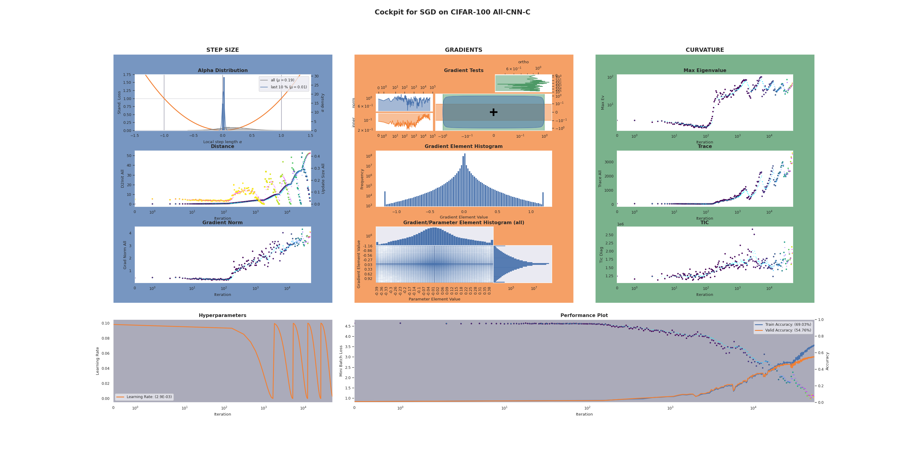
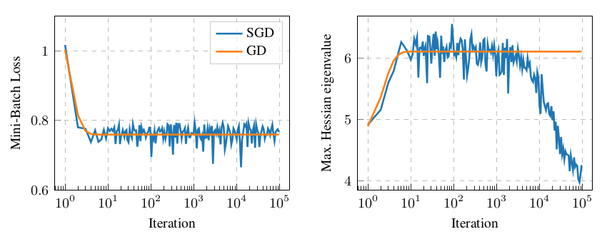
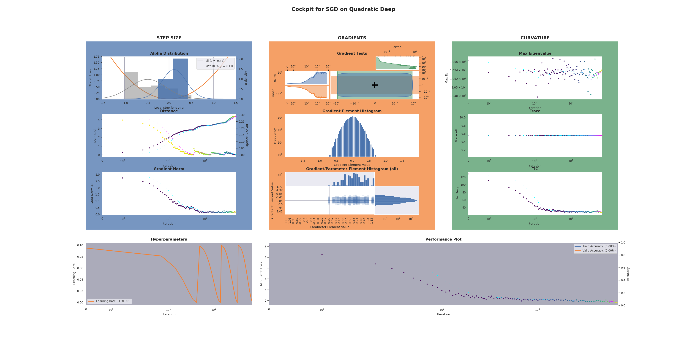

<!-- PROJECT LOGO -->
 

  <h3 align="center">A Practical Debugging Tool for Training Deep Neural Networks</h3>

  

    Experiments
  

  <a href="https://github.com/f-dangel/cockpit">Cockpit Package</a> •
  <a href="https://cockpit.readthedocs.io/">Docs</a> •
  <a href="LICENSE.txt">License</a>

## Experiments

To showcase the capabilities of [Cockpit](https://github.com/f-dangel/cockpit) we performed several experiments illustrating the usefulness of our debugging tool in [our paper](https://arxiv.org/abs/2102.06604). The code for all experiments, as well as the generated data is presented in this repository. For a discussion of those experiments please refer to our paper.

We provide an overivew of all experiments here, splitting them up in experiments that are presented in the main body of our paper and ones that are shown in the appendix.

All necessary requirements (besides [Cockpit](https://github.com/f-dangel/cockpit)) can be found in [requirements.txt](requirements.txt)

If you decide to re-run the code, you may want to delete the `~/temp/data_deepobs` directory, that will be created to share the data sets among experiments, afterwards.

All experiments include some `run.py` file to reproduce the results. Our original results are also stored in each experiment folder in a `results.zip` file. The `plot.py` script produces the Figures shown in the paper.

| Experiment                 | Description                                                                                                       |
| -------------------------- | ----------------------------------------------------------------------------------------------------------------- |
| 01_benchmark               | Benchmark the run time of individual instruments and configurations of Cockpit. Reproduces Figure 6 and 13-17. |
| 02_LINE                    | Illustrative Example of why just monitoring the loss is not enough. Reproduces Figure 1.                       |
| 03_scalar_deep             | Concrete example why just monitoring the loss is not enough. Reproduces Figure 11.                             |
| 04_benchmark_memory        | Benchmark the memory consumption of the histograms. Reproduces Figure 12.                                      |
| 06_preprocessing           | Study how incorrectly scaled data is represented in Cockpit. Reproduces Figure 3 and 10.                       |
| 07_learning_rate_selection | Grid search the learning rate and compare the alpha values vs. final performance. Reproduces Figure 5.         |
| 09_layerwise               | Analyzing the layerwise histogram for two different architectures. Reproduces Figure 4.                        |
| 10_showcase                | Showcase of the full Cockpit for DeepOBS problems. Reproduces Figure 2 and 19.                                 |
| 11_histogram2d             | Benchmark the performance of different implementations for computing the 2D Histogram. Reproduces Figure 18.   |
| 12_alpha_explanation       | Illustrative plot explaining the Alpha Quantity. Reproduces Figure 8.                                          |

## Main Text Experiments

#### Figure 1: Loss is not Enough - [`02_LINE`](experiments/02_LINE/README.md)

#### Figure 2: Showcase - [`10_showcase`](experiments/10_showcase/README.md)

#### Figure 3: Misscaled Data - [`06_preprocessing`](experiments/06_preprocessing/README.md)

#### Figure 4: Layerwise Histogram - [`09_layerwise`](experiments/09_layerwise/README.md)

#### Figure 5: Tuning the Learning Rate with Alpha - [`07_learning_rate_selection`](experiments/07_learning_rate_selection/README.md)

#### Figure 6: Run Time Benchmark - [`01_benchmark`](experiments/01_benchmark/README.md)

## Appendix Experiments

Figure 7 is not included in this list, as it is a code example. The code is an adapted
version of the [basic](https://github.com/f-dangel/cockpit/blob/main/examples/01_basic_fmnist.py) and [advanced](https://github.com/f-dangel/cockpit/blob/main/examples/02_advanced_fmnist.py) examples from the examples directory and the [documentation](https://cockpit.readthedocs.io/en/latest/examples/01_basic_fmnist.html).

#### Figure 8: Motivational Sketch for Alpha - [`12_alpha_explanation`](experiments/12_alpha_explanation/README.md)

#### Figure 10: Misscaled Data ImageNet - [`06_preprocessing`](experiments/06_preprocessing/README.md)

#### Figure 11: Regularization Detection - [`03_scalar_deep`](experiments/03_scalar_deep/README.md)

#### Figure 12: Memory Consumption Histogram - [`04_benchmark_memory`](experiments/04_benchmark_memory/README.md)

#### Figure 13 - 17: Additional Run Time Benchmarks - [`01_benchmark`](experiments/01_benchmark/README.md)

#### Figure 18: Implementation Performance 2D Histogram - [`11_histogram2d`](experiments/11_histogram2d/README.md)

#### Figure 19: Additional Showcases - [`10_showcase`](experiments/10_showcase/README.md)

